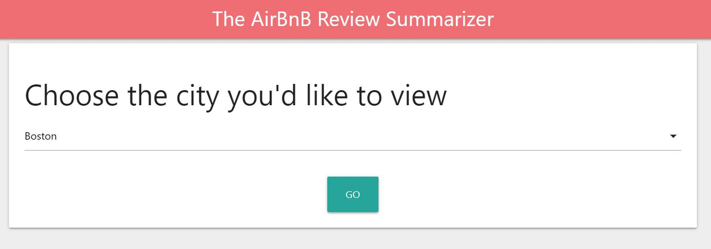
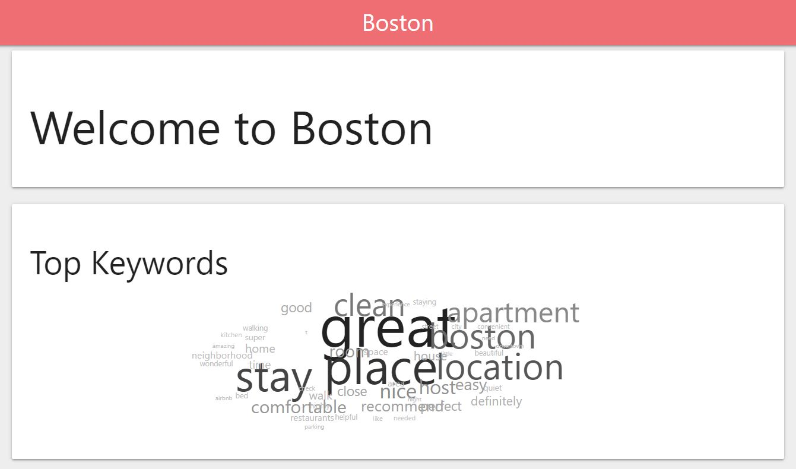
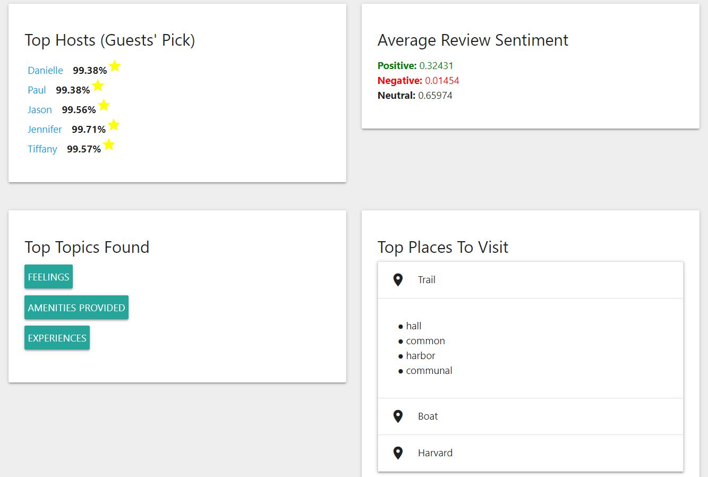

# AirBnB Review Summarizer

A tool to create visualizations out of AirBnB reviews per city.

Try the app at [VisualizeBnB](http://visualizebnb.pythonanywhere.com/)

All analysis was performed in python, with results being stored into a SQLite database, which is later used by the Flask application.

## Web App Screens:

## Techniques Used:

* Bag of Words (to create wordcloud using frequency of words)
* Sentiment Analysis (which also generates top hosts)
* Topic Modelling (to get vibe of city)
* Word2Vec (to get places to visit in city)
